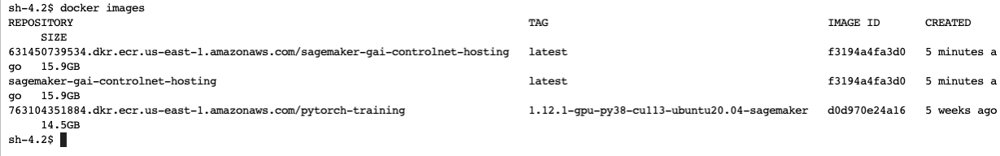
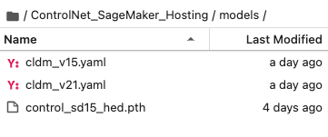

# ControlNet_SageMaker_Hosting

This project demonstartes how to deploy the pretrained Stable Diffusion model on Amazon SageMaker real-time endpoint. You can then integrate the model endpoint with any application to serve invocations against the model. In this example, we will use SageMaker notebook instance to complete the model deployment step and host the webserver on the notebook instance. You can also choose to use an ec2 instance or even local machine to host the [Gradio web interface](https://gradio.app/).

Here are the step-by-step instructions:

### Step 1: Prepare and build container for model hosting on SageMaker
<div class="alert alert-block alert-warning">
<b>Warning:</b> To build the docker image, you need to use a SageMaker notebook instance running on GPU, such as 'ml.g5.xlarge'. Also please make sure the free space in the disk of the instance is above 50GB.
</div>

To build the docker image for model hosting, we will extend the prebuilt pytorch container and `nginex + gunicorn` as reverse server. If you want to learn more about bringing your own container for model training and hosting, you can refer to the [scikit learn bring your own example on github](https://github.com/aws/amazon-sagemaker-examples/tree/main/advanced_functionality/scikit_bring_your_own/container). Note that, you can also use the prebuilt pytorch hosting  container to host the pre-trained model by leveraging the `entrypoint script` and `requirements.txt` files to configure the environment at run-time.  

Please note that, as the docker container can be quite big and the default docker storage on the instance default disck may not be enough. So when building the docker image on SageMaker notebook instances, we recommended to leverage the attached EBS volume (under /home/ec2-user/SageMaker) to store the docker images. This volume can be increased as needed, but you will not be able to reduce the EBS volume size once it is increased. On the SageMaker notebook instance, open a terminal and go to the SageMaker folder and clone the git repo:

```
cd /home/ec2-user/SageMaker
git clone https://github.com/melanie531/ControlNet_SageMaker_Hosting.git
cd ControlNet_SageMaker_Hosting

```

Then run the below command to prepare the docker environment:

```
cd ControlNet_bring_your_own_container
/bin/bash prepare-docker.sh
```

Next, we will go to the container directly where the *Dockerfile* is stored and build and push the docker image to ECR:

```
cd container
/bin/bash build_and_push.sh <your-docker-image-name>
```

In the docker image name field, you can specify the name of the docker image, such as **sagemaker-gai-controlnet-hosting**. This step might take a bit longer time (~ 15-20 mins) if this is the first time you are building the docker image and push it to ECR. Once the image is pushed to ECR, you can use the below command to check the docker image:

```
docker images
```



Now we can move to the next step to deploy the model using this docker image to a SageMaker endpoint.

### Step 2: Deploy the pretrained model to a SageMaker endpoint and invoke endpoint with test data

In this step, we will use the notebook **SageMaker_GAI_deploy_ControlNet.ipynb** to prepare the model artifacts and deploy the model to a SageMaker endpoint for inference. All the pretrained models of ControlNet can be found in their [Hugging Face page](https://huggingface.co/lllyasviel/ControlNet). In this example, we will use the [`control_sd15_hed.pth` ](https://huggingface.co/lllyasviel/ControlNet/blob/main/models/control_sd15_hed.pth) model. You can go to the model page and use the [download link ](https://huggingface.co/lllyasviel/ControlNet/resolve/main/models/control_sd15_hed.pth) to download the model artifacts to your local machine and upload to your s3 bucket. Then from the SageMaker notebook folder, you can use S3 copy command to copy the file to the local folder `ControlNet_SageMaker_Hosting/models`. The folder structure should be like:



Once the model data is downloaded, you can follow through the notebook to execute each cell and deploy the model to a SageMaker endpoint and perform testing with the sample json data `data.json`.

### Step 3: Build conda environment and launch Gradio web UI to provide interactive user experience

To execute the Gradio UI, we will build a custom conda kernel for the notebook **test_SageMaker_GAI_endpoint.ipynb**. In the terminal session (*assuming you are under the ControlNet_SageMaker_Hosting/container/ folder*, run the follow code:


```
cd ControlNet
conda env create -f environment.yaml
source activate control
conda install -c anaconda ipykernel
python -m ipykernel install --user --name=control
```

#### Additional resources
Note that, this git repository is adopted from the [ControlNet](https://github.com/lllyasviel/ControlNet) open source project. To understand more of the ControlNet neural network structure, please refer to the [source git repository](https://github.com/lllyasviel/ControlNet).